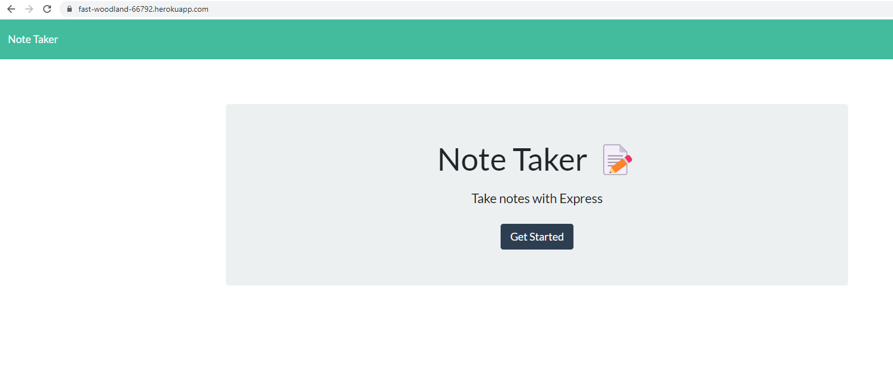
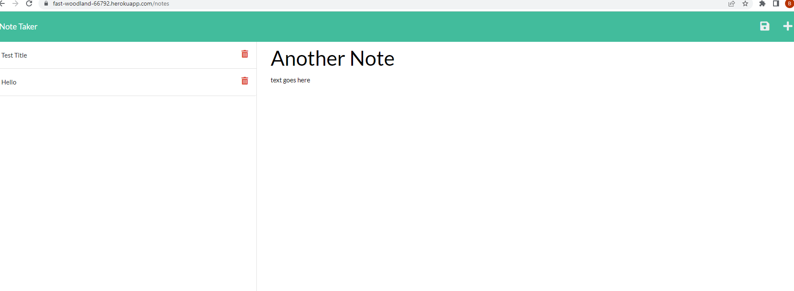

# mynotetaker

-  Created an application called Note Taker that can be used to write and save notes. This application uses an Express.js back end and saves and retrieves note data from a JSON file.
--
## Author

- [@brittanyremus](https://www.github.com/bremus124)
--
## Screenshot

--
## Deployment

- To deploy this project run:
    - Website:https://fast-woodland-66792.herokuapp.com/
    - Repository: https://github.com/bremus124/mynotetaker
